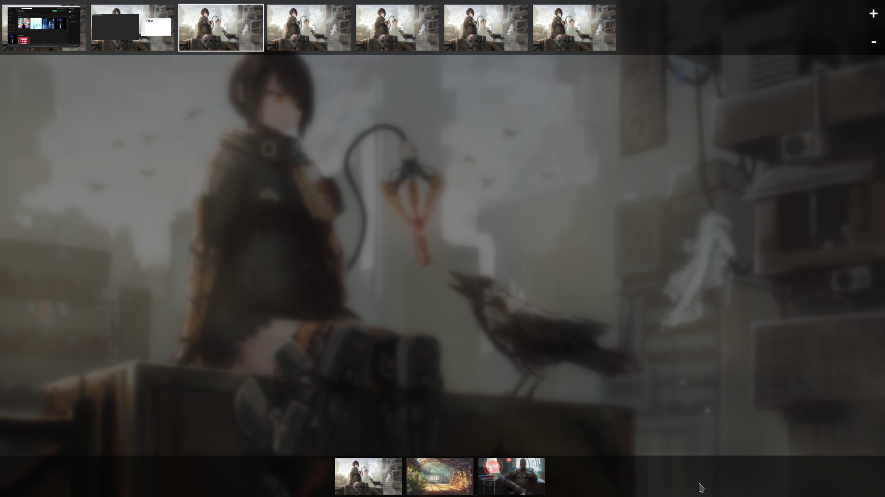

kwinOverview
===============

In progress clone of GNOME's activities for KWin, as a QML/JS script (kwinOverview is not the final name).  It owes a great debt to both GNOME Shell and Actos Dashboard (which doesn't work with KF5).  It's sort of a spiritual successor to Actos Dashboard, and in fact reading through/tinkering with that code allowed me to learn enough QML/JS to write this.  Written using QtQuick 2.7.  Currently in beta, so expect bugs.  Probably lots of them.  Especially since this is the first QML/JS thing I've ever written.



## Installation

  ```
  git clone https://github.com/ajoshpratt/kwinOverview.git
  cd kwinOverview
  plasmapkg --type kwinscript -i .
  ```
  
## Activation
  
Like most other KWin scripts, it can be activated from the KDE system settings.  The default registered shortcut is "Meta+A".

## Usage

Once you've hit Meta+A, you can start typing to search for applications to launch.  You can switch desktops by clicking/using the shortcut, and dragging/dropping applications to other desktops.  You can click on another activity on the bottom dash to switch to that activity (hover over for the activity name).  In addition, you can click and drag (or use the scroll wheel) the desktop dash above if there are more desktops than you have space available for!  So it supports the maximum number of desktops you can have on Plasma.

Works incredibly well with https://github.com/rliang/kwin-dynamic-virtual-desktops, which is what I'm using to manage the addition/removal of desktops (as there's currently no button to do so).

## Design Decisions

* Mostly, it was designed to be fast on my aging macbook pro.  The biggest slowdown comes from painting the active live thumbnails.  If you find this to be slowing down your computer, change the thumbnail scaling quality in KWin's compositor settings.

* In addition, I wanted to keep activities close but separate; hence why they're shown down below.  

* I've avoided using plasma components wherever possible (although it's still tied pretty heavily to activities), largely to maintain design cleanliness.

* By using the KWin scripting interface, it doesn't actually rely on compositing!  Although it really just shows the icon, so it's not terribly clear what application/window is what.

* Although I like scaling animations as much as the next person (visually, they're easy to parse), I found implementing them slowed down even my desktop with more than two windows on the screen; something about the repaints for the thumbnails is slow.

## Known Bugs

* Sometimes the 'type to start searching' function doesn't work on switching desktops.  Simply hide/show the dashboard to regain focus (if you're using the default shortcut, just hit Meta+A twice).

* Sometimes, swapping between activities 'hides' all the programs in the dashboard.  Hide/show fixes this.

* I suspect the thumbnails are still being painted even when the dashboard is hidden, increasing CPU usage for KWin.

* Does not work on Wayland, AT ALL.  Crashes KWin completely : (  I suspect this is because Activities themselves do not currently work on Wayland, and this makes heavy use of them.

## Future Directions

It's mostly feature complete, although I'll probably tinker around with the design a bit.

* Add a configuration dialog.  In particular, I'd like to make sure the blur effects are configurable (I can see how those would slow down the computer, under certain circumstances).

* Adjust how the grid configuration is done so that it takes more advantage of available screen space.

* Reduce CPU usage.

* Remove the silly grid bouncing effect when windows are added.

* Give it an actual name, instead of a working title.

* Add buttons to add/remove desktops?

* Cleanup the incredibly messy code.

* Add a license?
